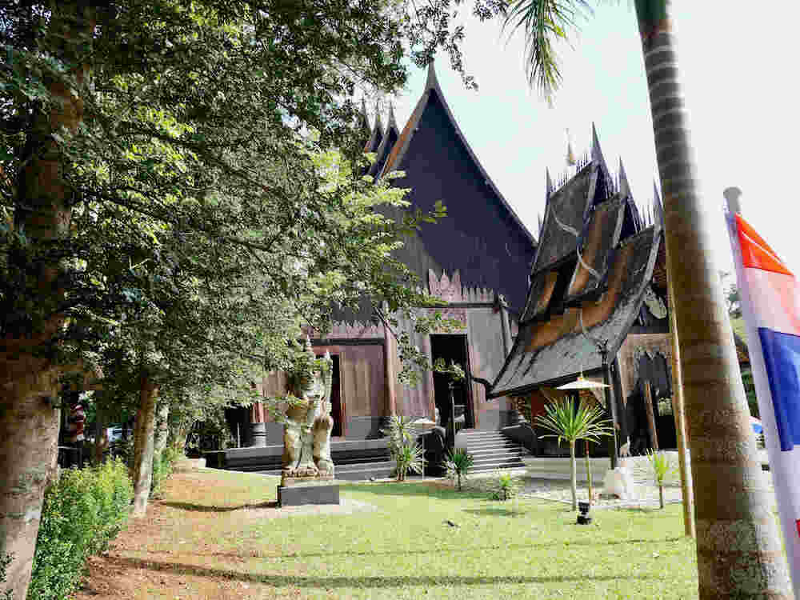

The Black House looks like a temple but it's really a bizarre art installation created by one of Thailand's most famous visual artists, Thawan Duchanee. 

 
 
The interior of each house presents a collection of oddities as well as a shrine to the artist who passed away in 2014.

 

 

This crocodile skin displayed in a dome shaped hut was super strange. 

 
