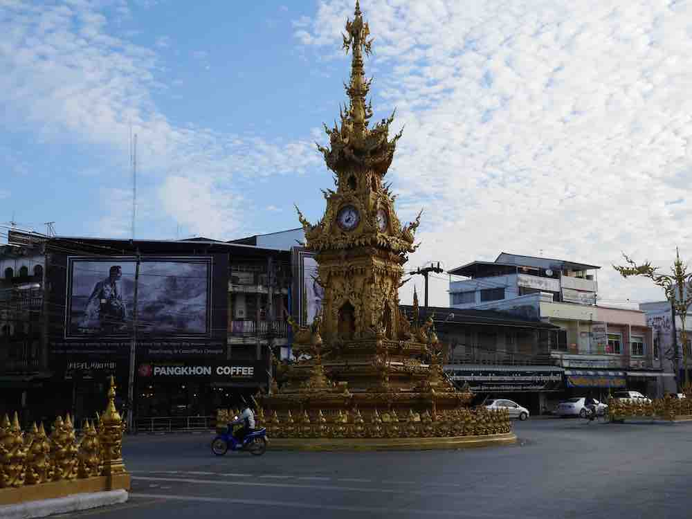
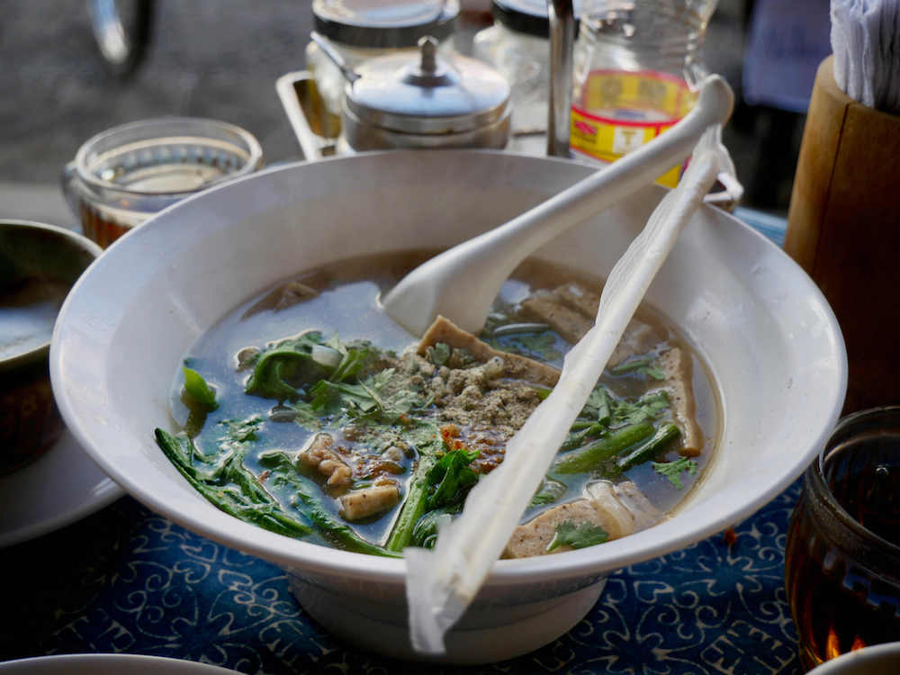
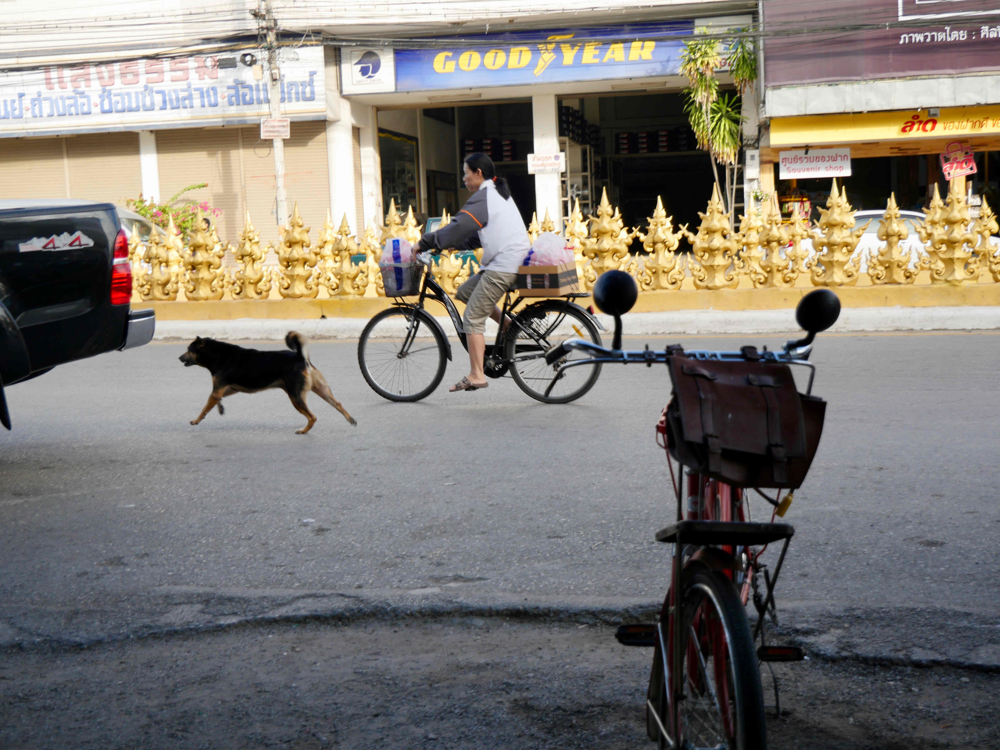

The ornate clock tower presides over a roundabout in downtown Chiang Rai city.

This area is great for food and inexpensive lodgings.  You can get coffee or grab breakfast and watch the traffic zoom around the clock tower from the small street cafes.

Lucky shot of a street dog and this cyclist passing by. 

 