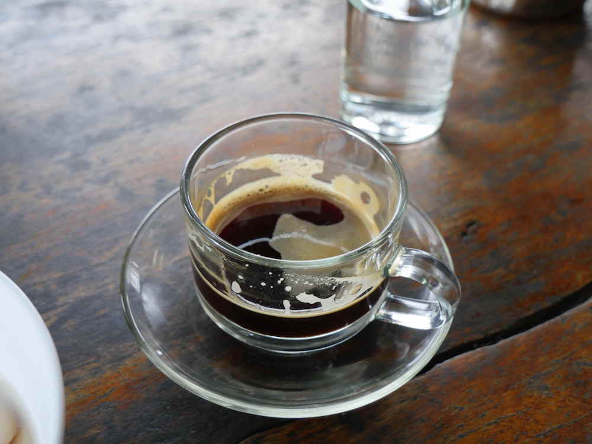
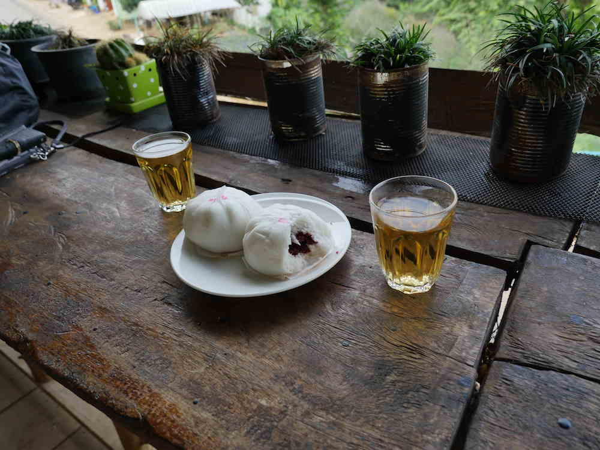

There are two worthy stops for coffee in Doi Chang.  The cup was from the Doi Chang Coffe Growers Collective which is definitely worth a visit.

We were lucky enough to have a local take us up to this viewpoint to watch the sunrise.  

Back at the coffee collective, we ordered steamed buns and they came with coffee essence which is tea made from the coffee flowers.  

