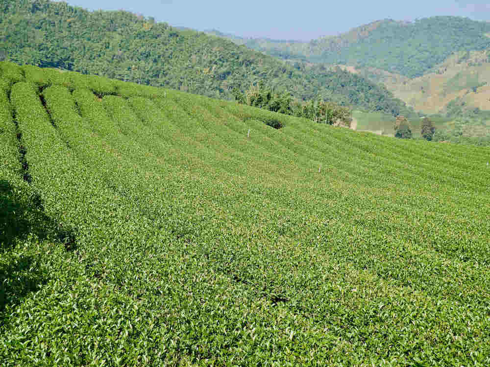

Way up on the border with Myanmar is the small village of Doi Mae Salong which is famous for growing excellent quality oolong tea. 

We sat down for a tea tasting in a building that also housed tea processing and storage facilities.

Walk amongst the rows of tea shrubs and take in the beauty of the mountains of Northern Thailand.

