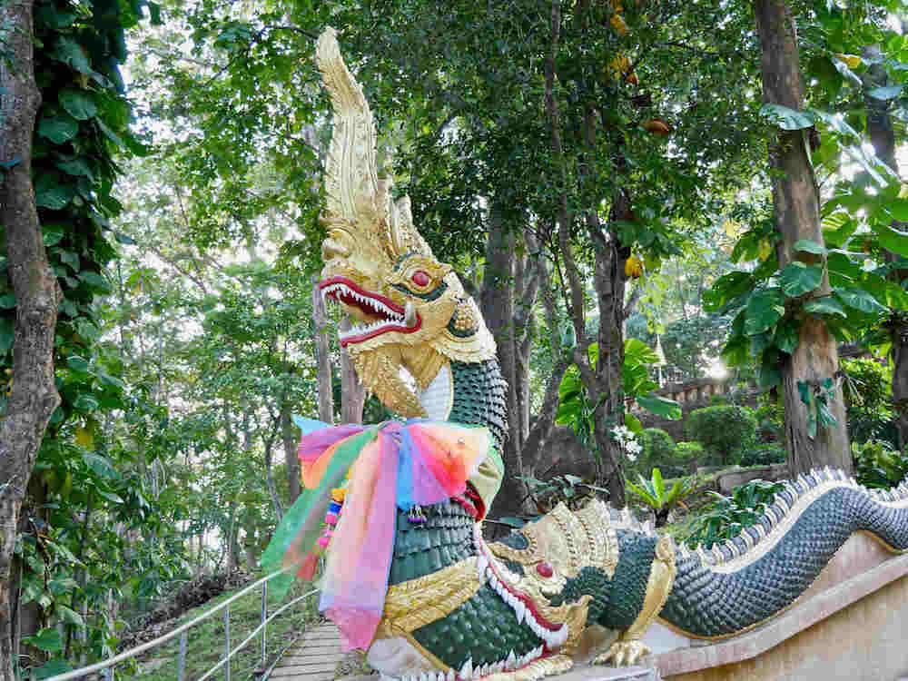
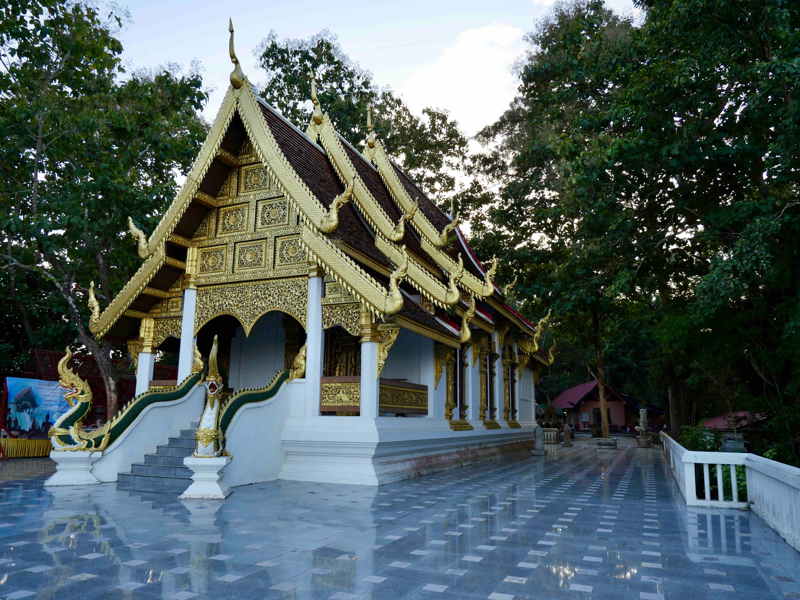

This ornate water dragon or "naga" guards the entrance to a temple complex on a bluff overlooking the Mekong river.

This amazing temple was closed on arrival but we still got this lucky shot of the polished luminescent marble floor glowing as the sun went down.

It's common for the the monks to adorn the statues that surround the chedi's of the older temple complexes.  This statue is possibly well over 500 years old.

