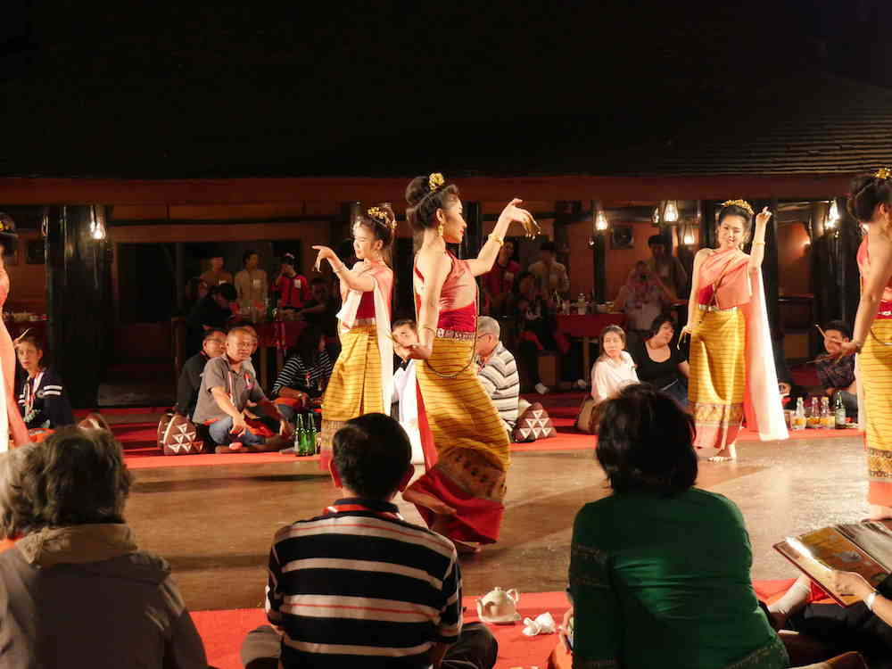

Northern Thai Lanna style dancers were definitely a highlight. 

 
Stick dancing with bamboo poles is common throughout Southeast Asia.

There are many different regional tribes referred to in Thailand as "hill tribes."  Each has their own distinct dress, dance and music.

