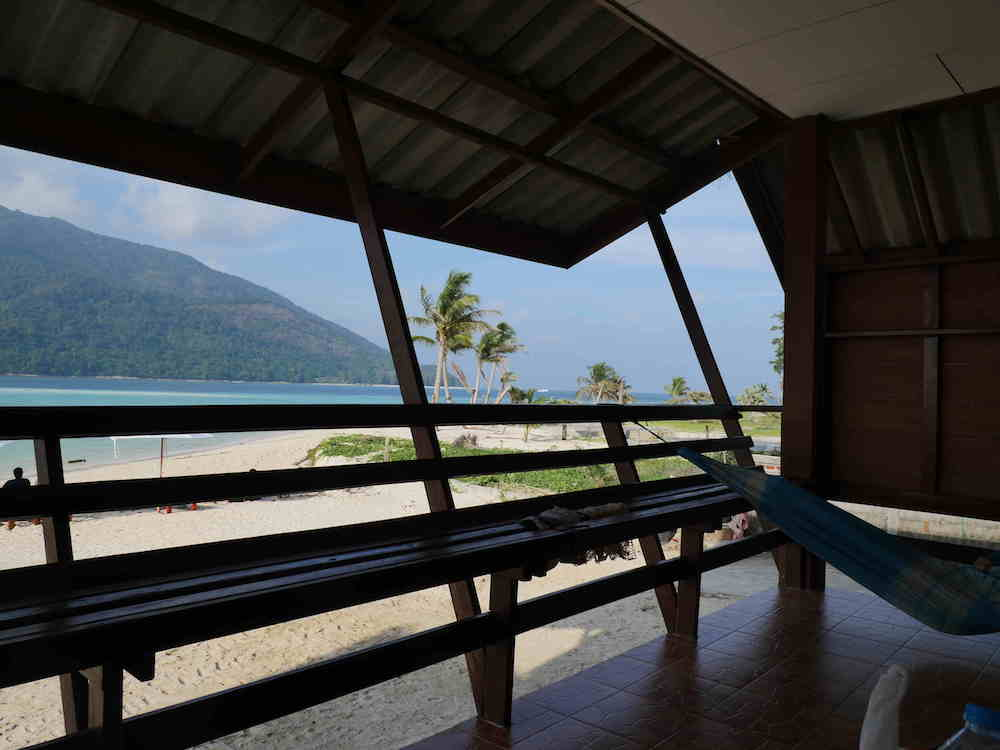

Koh Lipe is located on the Andaman Sea in Thailand's deep south on the border with Malaysia. 

We stayed in this beach bungalow on the northern side of the island at the Mountain Report which is know mostly to Thai's on holiday.

The snorkeling was incredible.  We rented our on long-tail boat and local guide for a day of island hopping and snorkeling over coral forests like this.

