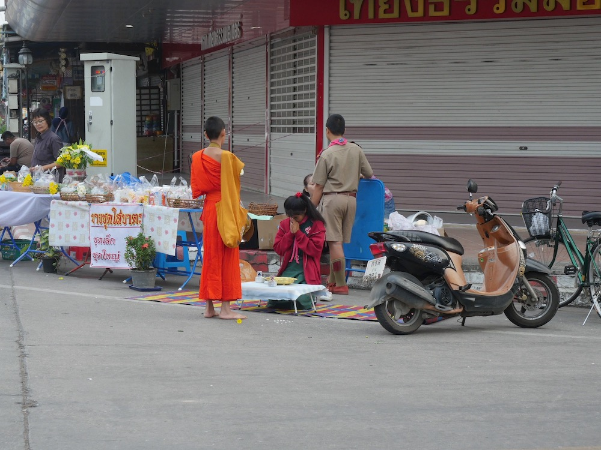
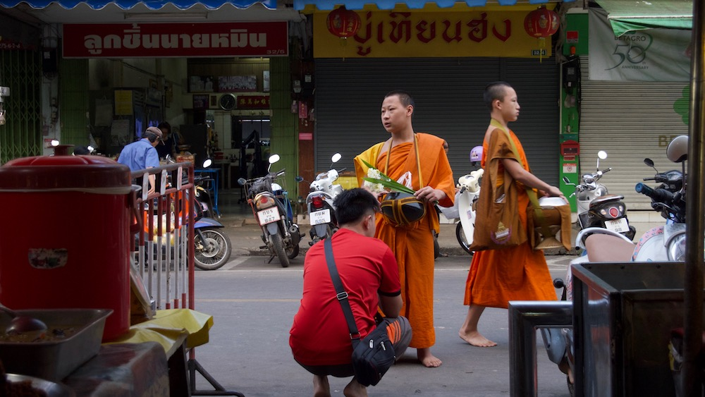
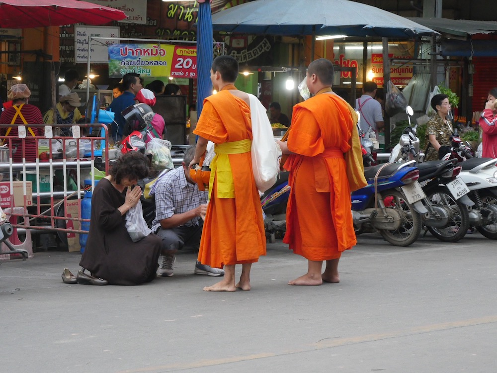

A very young monk novice receiving alms from a local school girl at the morning market in Nan province.

When you offer alms to monks in Thailand, they will often give you a blessing in the form of a chant. This morning market in Nan was amazing for seeing how regular Thais go about their days.

Two young monks receiving alms from a couple in the morning market.  This scene is common throughout Thailand but it's become commercialized in the more touristy parts of the country.

