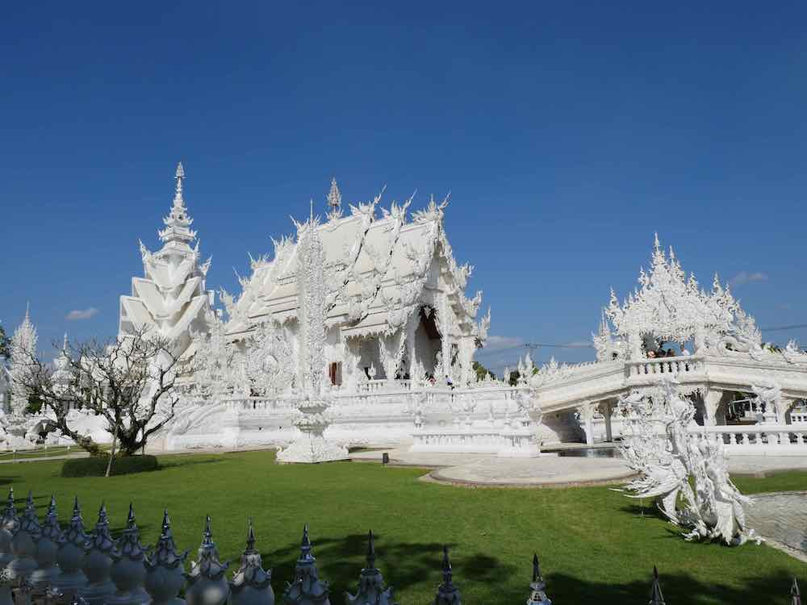
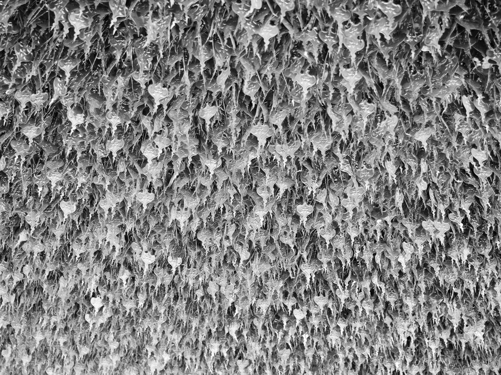
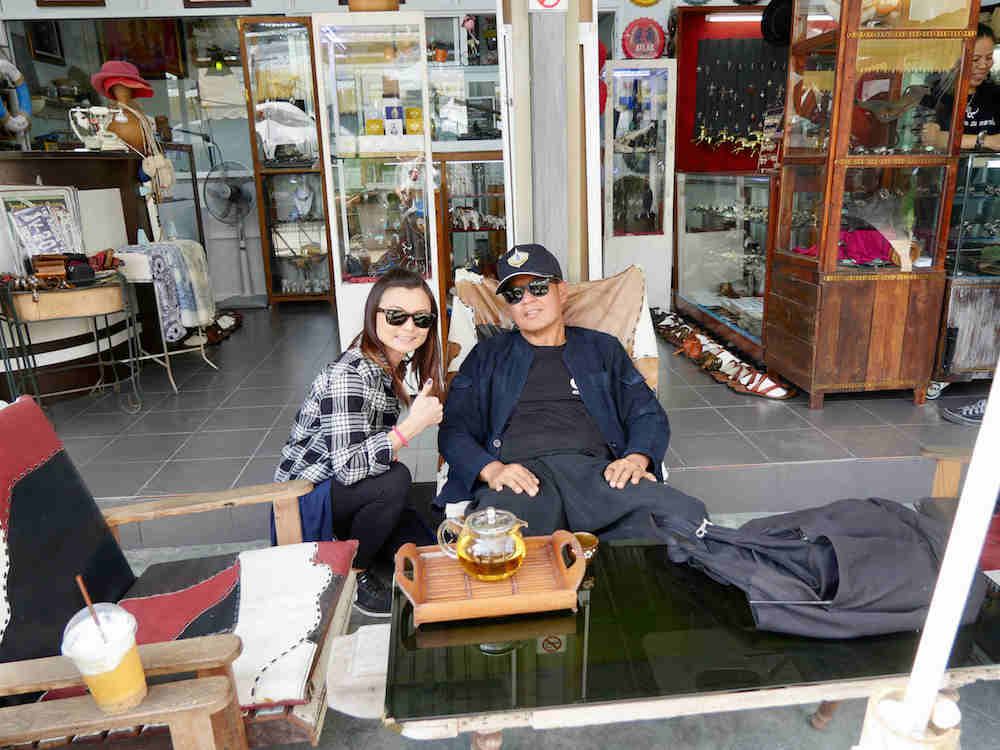

Wat Rong Khun is a stunning piece of art as well as a functioning Buddhist temple located in Chiang Rai, Thailand.

These silver amulets hung in the thousands underneath the awnings of the temple buildings.

 

Cher posing with the artist who created the temple, Chalermchai Kositpipatm who just happened to be having a cup of coffee. 

 
